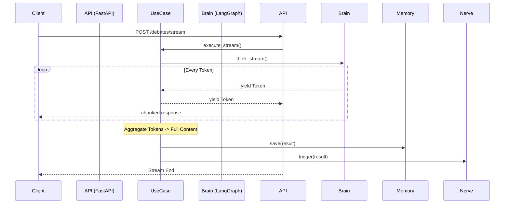

# Architecture Documentation (Clean Architecture)

MACS 프로젝트는 유지보수성과 확장성을 최우선으로 고려하여 **Clean Architecture (Layered Architecture)**를 채택했습니다.

## 1. 아키텍처 원칙 (Principles)
가장 중요한 규칙은 **"의존성 규칙 (Dependency Rule)"**입니다.
소스 코드의 의존성은 반드시 **안쪽(Domain)**을 향해야 하며, 절대 바깥쪽(Infrastructure)으로 향해서는 안 됩니다.

```mermaid
graph TD
    Interface[Interfaces (Web/CLI)] --> UseCase[Use Cases]
    Infrastructure[Infrastructure (DB/LLM)] --> Domain[Domain (Entities)]
    UseCase --> Domain
```

## 2. 계층 구조 (Layers)

### 2.1. Domain Layer (`app/domain`)
- **역할**: 애플리케이션의 핵심 비즈니스 개념과 규칙을 정의합니다.
- **구성 요소**:
    - **Entities**: 데이터 구조 (`DebateResult`).
    - **Interfaces**: 외부 시스템과 소통하기 위한 추상 인터페이스 (`ThinkingBrain`, `MemoryVault`).
- **특징**: 그 어떤 외부 라이브러리에도 의존하지 않는 **Pure Python** 코드입니다.

### 2.2. Use Case Layer (`app/usecases`)
- **역할**: 시스템이 수행해야 할 구체적인 작업 흐름을 정의합니다.
- **구성 요소**: `RunDebateUseCase`.
- **특징**: Domain Interface를 통해 인프라와 소통합니다 (Dependency Injection).

### 2.3. Infrastructure Layer (`app/infrastructure`)
- **역할**: 인터페이스의 실제 구현체를 담당합니다.
- **구성 요소**:
    - `LangGraphBrain`: LangChain/LangGraph 구현체.
    - `LocalAdapter`: 파일 시스템 및 ChromaDB 구현체.
    - `N8nAdapter`: HTTP Request 구현체.

### 2.4. Interface Layer (`app/interfaces`)
- **역할**: 외부 세계와 애플리케이션을 연결합니다.
- **구성 요소**:
    - `api`: FastAPI Router 및 Schemas.
    - `cli`: 터미널 실행기.

### 2.5. Streaming Architecture (Phase 5.5)
**"Real-time Feedback Loop"**
LLM의 긴 응답 시간을 극복하기 위해 **Async Generator Pattern**을 사용합니다.



## 3. 개발 가이드 (Dev Guide)

새로운 기능을 추가할 때는 **"안쪽에서 바깥쪽으로"** 개발하세요.

1.  **Domain**: 필요한 데이터와 Interface를 정의합니다.
2.  **UseCase**: 비즈니스 로직을 구현합니다. (이때 TDD를 하면 좋습니다.)
3.  **Infrastructure**: Interface를 구현하는 Adapter를 만듭니다.
4.  **Inteface**: 사용자에게 노출할 API나 CLI 명령어를 추가합니다.
5.  **Main**: `main.py`에서 의존성을 조립합니다.
