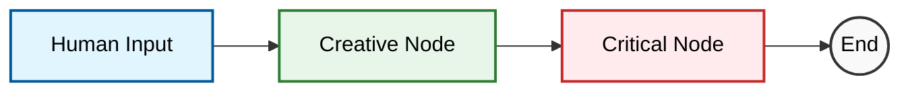

# 아키텍처: Core Loop (토론 엔진)

이 문서는 **Spec 002**에서 구현된 **MACS의 핵심 토론 로직**과 **LangGraph**의 동작 원리를 설명합니다.

## 1. 개요 (Overview)
MACS의 "뇌"는 **LangGraph**를 사용하여 구현되었습니다. LangGraph는 AI 에이전트 간의 상호작용을 **그래프(Node & Edge)** 형태로 순서도를 그리듯 정의하는 프레임워크입니다.

### 핵심 개념
- **State (상태)**: 대화의 "기억"입니다. 모든 에이전트가 공유하는 메시지 리스트(`messages`)를 담고 있습니다.
- **Node (노드)**: 실제로 일을 하는 "작업자"입니다. 여기서는 `Creative Agent`와 `Critical Agent`가 각각 하나의 노드입니다.
- **Edge (엣지)**: 작업 순서입니다. "A 다음엔 B로 가라"는 화살표 역할을 합니다.

## 2. 동작 흐름 (Flow)

사용자가 주제를 던지면, 아래 순서대로 데이터가 흐릅니다.



1.  **Start**: `agents/runner.py`가 사용자의 주제(Topic)를 받아 **State**에 넣습니다.
2.  **Creative Node**:
    - State에서 대화 내용을 읽습니다.
    - `CREATIVE_SYSTEM_PROMPT`를 장착하고 Gemini에게 "아이디어를 발산하라"고 요청합니다.
    - Gemini의 응답을 State에 추가(Append)합니다.
3.  **Critical Node**:
    - 업데이트된 State(사용자 질문 + 창의적 답변)를 읽습니다.
    - `CRITICAL_SYSTEM_PROMPT`를 장착하고 Gemini에게 "비판하라"고 요청합니다.
    - 비판 내용을 State에 추가합니다.
4.  **End**: 더 이상 연결된 엣지가 없으므로 종료합니다. 결과물은 CLI에 출력됩니다.

## 3. 코드 구조 설명

### `agents/state.py`
```python
class AgentState(TypedDict):
    messages: Annotated[List[BaseMessage], add_messages]
```
- **`messages`**: 대화가 오고 갈 때마다 리스트가 덮어씌워지는 게 아니라, **계속 누적(`add_messages`)** 되도록 설정했습니다. 그래서 Critical Agent가 앞선 Creative Agent의 말을 기억할 수 있습니다.

### `agents/graph.py`
- 모델 설정: `ChatGoogleGenerativeAI` (Gemini 2.0 Flash)
- **`workflow.add_node`**: 에이전트 등록.
- **`workflow.add_edge`**: 순서 연결 (`Creative` -> `Critical`).

### `agents/prompts.py`
- 에이전트들의 성격(페르소나)을 정의한 대본입니다.
- **Creative**: Yes, and... (긍정적 확장)
- **Critical**: Yes, but... (냉철한 분석)

## 4. 왜 LangChain/LangGraph인가?
단순히 API를 두 번 호출하는 것과 달리, LangGraph를 쓰면 다음과 같은 확장이 가능해집니다:
- **분기(Branching)**: Creative의 아이디어가 별로면 다시 Creative에게 돌려보내는 판단 로직 추가 가능.
- **순환(Loop)**: 토론이 만족스러울 때까지 계속 핑퐁하게 만드는 기능.
- **메모리 관리**: 대화가 길어져도 시스템이 자동으로 문맥을 관리.
