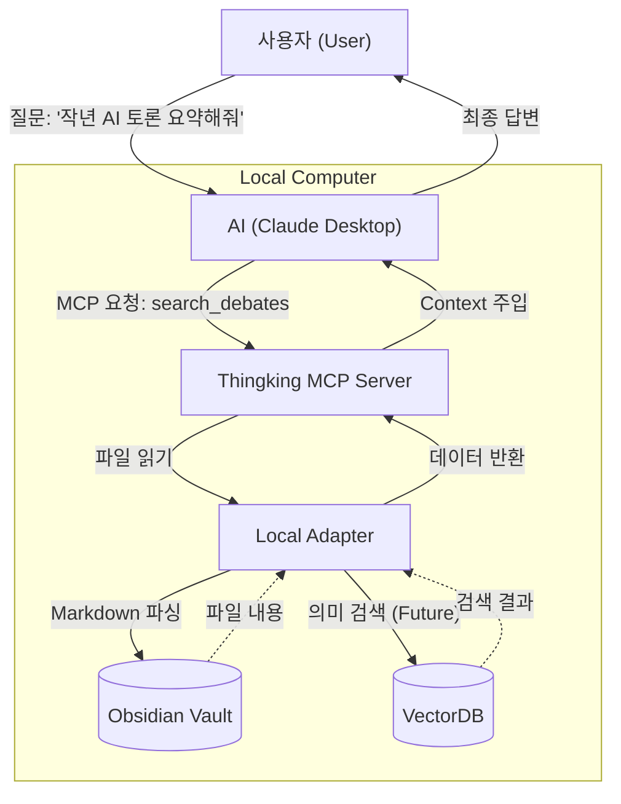

# Thingking Model Context Protocol (MCP) Guide

이 문서는 Thingking 애플리케이션의 MCP(Model Context Protocol) 서버 통합에 대해 설명합니다. 사용자가 제공한 인사이트를 바탕으로 개념과 동작 원리를 쉽게 풀어서 정리했습니다.

## 1. Concept: "AI를 위한 USB 포트"

과거에는 AI(Claude, ChatGPT 등)에게 내 컴퓨터에 있는 파일이나 특정 서비스의 데이터를 보여주려면, 일일이 복사해서 붙여넣거나 복잡한 연동 과정을 거쳐야 했습니다.

**MCP(Model Context Protocol)**는 이 과정을 표준화한 **"공용 USB 포트"**와 같습니다.

*   **표준화**: 어떤 AI 모델이든 MCP라는 규격만 맞추면 Thingking의 데이터를 읽어갈 수 있습니다.
*   **중계자**: 사용자가 "어제 했던 토론 내용 찾아줘"라고 하면, AI가 이 말을 이해하고 Thingking의 데이터베이스(파일, ChromaDB)에서 정확한 정보를 꺼내오도록 돕습니다.

## 2. User Scenarios (UX)

사용자 입장에서 MCP가 어떻게 동작하는지 두 가지 시나리오로 살펴봅니다. 핵심은 **"AI가 내 개인 비서처럼 내 데이터를 직접 들여다보고 대답한다"**는 점입니다.

### 시나리오 A: 정보 조회 (Resources)
*   **사용자**: "최근에 'AI 윤리'에 대해 토론했던 내용들 리스트 좀 보여줘."
*   **AI의 동작**: "Thingking 서버야, `debate://list` 경로에 있는 데이터를 보여줘." (리소스 접근)
*   **결과**: AI가 최근 토론 목록을 가져와서 "네, 'AI 윤리', '데이터 프라이버시' 등 3건이 있습니다."라고 답변합니다.

### 시나리오 B: 검색 및 분석 (Tools)
*   **사용자**: "내 토론 기록 중에 '철학적 좀비'라는 단어가 나온 부분 찾아줘."
*   **AI의 동작**: `search_debates(query="철학적 좀비")` 도구를 실행합니다. (함수 호출)
*   **결과**: AI가 수많은 파일 중 해당 단어가 포함된 부분을 찾아내어 요약해 줍니다.

- **결과**: AI가 수많은 파일 중 해당 단어가 포함된 부분을 찾아내어 요약해 줍니다.

## 3. 핵심 개념 (Core Concepts)

### 3.1. 왜 별도의 서버(SSE)가 필요한가요?
보통의 MCP 서버(Stdio)는 Claude Desktop 같은 로컬 앱이 **직접 실행**합니다. 하지만 **OpenWebUI**는 Docker라는 격리된 공간(가상의 다른 컴퓨터)에 있습니다.
그래서 마치 **"인터넷 전화선"**을 연결하듯, **SSE (Server-Sent Events) 방식**으로 호스트(내 맥북)에 있는 서버와 연결해야 합니다.

### 3.2. 누가 판단하고 누가 실행하나요? (The Execution Flow)
가장 혼동하기 쉬운 부분입니다. **"판단(Reasoning)"**과 **"실행(Execution)"**은 분리되어 있습니다.

1.  **OpenWebUI (Client)**: 사용자의 말을 LLM에게 전달하는 **메신저**입니다.
2.  **LLM (Brain)**: 사용자의 말을 듣고 **"판단"**합니다.
    *   *"사용자가 저장을 원하네? `save_debate` 도구를 써야겠다!"* (결정)
3.  **Thingking MCP (Hand)**: LLM의 결정을 전달받아 **"실행"**합니다.
    *   *실제 파일 생성 및 DB 저장은 여기서(FastAPI/Uvicorn) 일어납니다.*

즉, **FastAPI(Thingking)**는 알아서 판단하는 주체가 아니라, **LLM이 시킨 일을 수행하는 충실한 손발**입니다.

## 4. Architecture & Mechanics

Thingking MCP 시스템의 구조와 동작 원리입니다.



### 3.1. 파일을 찾는 방법 (Discovery)
MCP는 내 컴퓨터 전체를 무작위로 뒤지지 않습니다.
*   **지정된 경로**: 개발자가 코드(`LocalAdapter`)에 지정한 폴더(예: `data/archives`)만 바라봅니다.
*   **인덱싱 (ChromaDB)**: 파일이 많을 경우를 대비해, 내용을 벡터(숫자)로 변환해 저장해 둡니다. 이를 통해 단순 단어 매칭뿐만 아니라 "의미 기반 검색"이 가능해집니다.

### 3.2. 권한 관리 (Permissions)
AI가 내 컴퓨터를 마음대로 휘젓는 것이 아닙니다.
*   **사용자 승인**: 사용자가 설정 파일(`claude_desktop_config.json`)에 서버를 등록하고, 직접 실행(`uv run...`)했기 때문에 권한이 부여됩니다.
*   **범위 제한**: MCP 서버는 프로그래밍된 기능(읽기, 검색 등) 외에는 시스템의 다른 부분에 접근하지 못합니다.

## 4. Deep Dive: Context & RAG

MCP를 사용하는 근본적인 이유는 AI의 기억력 한계를 극복하기 위함입니다.

| 개념 | 설명 | 비유 |
| :--- | :--- | :--- |
| **Context Window** | AI가 한 번에 기억할 수 있는 대화의 양 (단기 기억) | 책상의 크기 (한 번에 펼쳐볼 수 있는 책의 양) |
| **ChromaDB / Files** | 영구적으로 저장된 방대한 데이터 (장기 기억) | 거대한 도서관의 서고 |
| **MCP / RAG** | 필요한 정보만 찾아서 AI에게 제공하는 과정 | 사서가 필요한 책만 뽑아서 책상 위에 올려주는 것 |

**Why MCP?**
AI의 '책상(Context Window)'은 크기가 제한적입니다. 수천 개의 토론 파일을 다 올려둘 수 없습니다. MCP는 AI에게 **"필요할 때마다 서고(ChromaDB)에 가서 책을 꺼내볼 수 있는 출입증"**을 주는 것과 같습니다. 이로써 AI는 사용자의 모든 과거 기록을 아는 것처럼 똑똑하게 행동할 수 있습니다.

## 5. Usage Guide

### 5.1. 서버 실행 (Standalone)
```bash
uv run python -m app.interfaces.mcp_server
```

### 5.2. Claude Desktop 연동
`~/Library/Application Support/Claude/claude_desktop_config.json` 파일을 수정합니다.

```json
{
  "mcpServers": {
    "thingking": {
      "command": "uv", // 'uv' 절대 경로 사용 권장 (예: /Users/ck/.local/bin/uv)
      "args": [
        "run",
        "python",
        "-m",
        "app.interfaces.mcp_server"
      ],
      "cwd": "/Users/ck/Project/Thingking" // 절대 경로 필수 (프로젝트 루트)
    }
  }
}
```
설정 후 Claude Desktop을 재시작하면 🔌 아이콘이 활성화됩니다.

## 6. OpenWebUI 연동 (Docker)
Docker 환경에서 실행되는 OpenWebUI와 연동하려면 SSE 모드를 사용해야 합니다.

### 6.1. SSE 모드로 서버 실행
```bash
uv run python -m app.interfaces.mcp_server --sse
```
- 주소: `http://0.0.0.0:8000/sse`
- **주의**: `0.0.0.0`으로 실행되므로 신뢰할 수 있는 로컬 네트워크에서만 사용하세요.

### 6.2. OpenWebUI 설정
1. OpenWebUI **관리자 패널 (Admin Panel)**에 접속합니다.
2. **Settings (설정) > Connections** 메뉴로 이동합니다.
3. **MCP Servers** 섹션에서 `+` 버튼을 클릭합니다.
4. 다음 정보를 입력합니다:
    - **URL**: `http://host.docker.internal:8000/sse`
    - *참고: Mac/Windows Docker Desktop 사용자는 `host.docker.internal`을 사용합니다. Linux 사용자는 `172.17.0.1` 또는 호스트 IP를 사용하세요.*
5. **Verify/Save** 버튼을 누릅니다. (Status가 초록색으로 변해야 합니다)

### 6.3. 기능 사용
- **검색**: 채팅창에서 `@thingking`을 멘션하거나, 도구를 활성화한 후 "지난번 토론 찾아줘"라고 입력.
- **저장**: "방금 대화 내용 저장해줘"라고 입력하면 `save_debate` 도구가 실행되어 로컬 파일로 저장됩니다.
