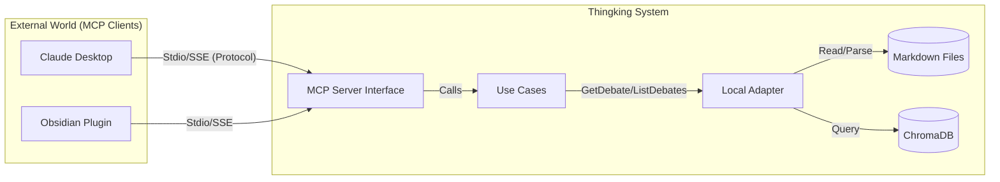

# Thingking Model Context Protocol (MCP) Guide

이 문서는 Thingking 애플리케이션의 MCP(Model Context Protocol) 서버 통합에 대해 설명합니다.

## 1. Concept: What is MCP?
**Model Context Protocol (MCP)** 는 LLM(Large Language Model) 애플리케이션과 외부 데이터/도구 간의 표준화된 통신 프로토콜입니다.
Thingking은 MCP **Server**로 동작하여, Claude Desktop이나 Obsidian과 같은 **Client**에게 자신이 가진 데이터(토론 내역)와 기능(검색)을 제공합니다.

## 2. Architecture

Thingking의 MCP 구조는 다음과 같습니다.



- **MCP Layer** (`app/interfaces/mcp_server.py`): 외부 요청을 받아 UseCase로 라우팅합니다.
- **UseCase Layer** (`app/usecases/manage_debates.py`): 비즈니스 로직을 처리합니다.
- **Infrastructure Layer** (`app/infrastructure/storage/local_adapter.py`): 마크다운 파일과 벡터 DB에 접근합니다.

## 3. Capabilities

### Resources (Data Retrieval)
MCP Client는 `debate://` URI 스킴을 사용하여 데이터를 조회할 수 있습니다.

| URI | Description | Example |
|-----|-------------|---------|
| `debate://list` | 최근 토론 목록을 조회합니다. | "Show me the list of recent debates." |
| `debate://{topic}` | 특정 토론의 전체 내용을 조회합니다. | "Read the full content of 'AI Safety' debate." |

### Tools (Function Execution)
MCP Client는 함수 호출(Function Calling)을 통해 기능을 실행할 수 있습니다.

| Tool Name | Arguments | Description |
|-----------|-----------|-------------|
| `search_debates` | `query` (str) | 키워드를 사용하여 토론 주제와 내용을 검색합니다. |

## 4. Usage Guide

### 4.1. 서버 실행 (Standalone)
Thingking MCP 서버는 기본적으로 Stdio(Standard Input/Output) 방식을 사용합니다.

```bash
uv run python app/interfaces/mcp_server.py
```

### 4.2. Claude Desktop 연동
Claude Desktop 앱의 설정 파일(구성 설정 접근)을 열고 다음 내용을 추가하세요.

**macOS config path**: `~/Library/Application Support/Claude/claude_desktop_config.json`

```json
{
  "mcpServers": {
    "thingking": {
      "command": "uv",
      "args": [
        "run",
        "python",
        "/absolute/path/to/Thingking/app/interfaces/mcp_server.py"
      ]
    }
  }
}
```
*주의: `uv`와 `Thingking` 프로젝트 경로는 절대 경로(Absolute Path)를 사용해야 합니다.*

설정 후 Claude Desktop을 재시작하면, 🔌 아이콘과 함께 Thingking 도구가 활성화된 것을 확인할 수 있습니다.
